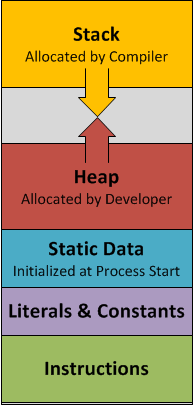
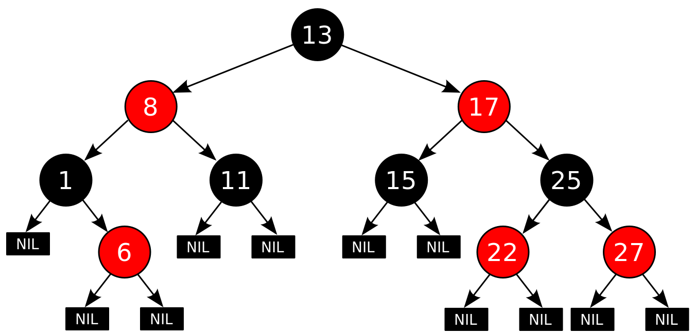

# Efficient C++ Programming

F. Giacomini · S. Balducci  
INFN-CNAF | CERN

ESC25 — Bertinoro, 29 September – 9 October 2025


---

## Outline

- Introduction
- Algorithms and functions
- Containers
- Resource management
- Move semantics
- Compile-time computation
- Additional material

---

# Introduction

---

## What is C++

C++ is a complex and large programming language (and library)

- strongly and statically typed
- general-purpose
- multi-paradigm
- good from low-level programming to high-level abstractions
- efficient (*"you don't pay for what you don't use"*)
- standard

---

## Learn more

- Start from
  - https://isocpp.org/
  - https://cppreference.com/
  - https://isocpp.github.io/CppCoreGuidelines/CppCoreGuidelines
- Main C++ conferences
  - https://github.com/cppcon, https://youtube.com/cppcon
  - https://github.com/boostcon, https://youtube.com/boostcon

---

## Standards

- A new standard is published every three years.

- *Working drafts*, almost the same as the final published document
  - **C++03** https://wg21.link/n1905
  - **C++11** https://wg21.link/std11
  - **C++14** https://wg21.link/std14
  - **C++17** https://wg21.link/std17
  - **C++20** https://wg21.link/std20
  - **C++23** https://wg21.link/std23

---

## Compilers

- The ESC machines provide at least two C++ compilers: use gcc 14.2.1 (see instructions on how to enable it), but the default gcc 11.5 is also available
- Additionally, you can edit and try your code online with multiple compilers at
  - https://godbolt.org/
  - https://coliru.stacked-crooked.com/
  - https://wandbox.org/

---

# Algorithms and functions

---

## The C++ standard library

- The standard library contains components of general use
  - **containers (data structures)**
  - **algorithms**
  - strings
  - input/output
  - random numbers
  - regular expressions
  - concurrency and parallelism
  - filesystem
  - ...

- The subset containing containers and algorithms is known as STL (Standard Template Library)
- But templates are everywhere

---

## STL Algorithms

- Generic functions that operate on **ranges** of objects
- Implemented as function templates

- **Non-modifying** `all_of any_of for_each count count_if mismatch equal find find_if adjacent_find search ...`
- **Modifying** `copy fill generate transform remove replace swap reverse rotate shuffle sample unique ...`
- **Partitioning** `partition stable_partition ...`
- **Sorting** `sort partial_sort nth_element ...`
- **Set** `set_union set_intersection set_difference ...`
- **Min/Max** `min max minmax lexicographical_compare clamp ...`
- **Numeric** `iota accumulate reduce inner_product partial_sum adjacent_difference ...`

---

## Range

- A range is defined by a pair of **iterators** [*first*, *last*), with *last* referring to one past the last element in the range
  - the range is *half-open*
  - *first* == *last* means the range is empty
  - *last* can be used to return failure
- An **iterator** allows to go through the elements of the associated range
  - operations to advance, access, compare
  - typically obtained from containers calling specific methods
- An iterator is a generalization of a pointer
  - it supports the same operations, possibly through overloaded operators
  - certainly `* ++ -> == !=`, maybe `-- + - += -= <`
- C++20 introduced `ranges`, a new library of *concepts* and components for dealing with ranges of objects (not discussed here)

---

## Range (cont.)

```
[memory layout: array 'a' with elements 123, 456, 789 at 0xab00/04/08; 'first' iterator starts at 0xab00, 'last' at 0xab0c]
```

```cpp
std::array<int,3> a{123, 456, 789}; // CTAD
auto first = a.begin();       // or std::begin(a)
auto const last = a.end();    // or std::end(a)
while (first != last) {       // compare
  ... *first ...;             // access
  ++first;                    // advance
}
```

- `std::array<T>::iterator` models the *RandomAccessIterator* concept

---

## Generic programming

- A style of programming in which **algorithms** are written in terms of **concepts**

```cpp
template <class Iterator, class T>
Iterator
find(Iterator first, Iterator last, const T& value)
{
  for (; first != last; ++first)
    if (*first == value)
      break;
  return first;
}
```

- A concept is a set of requirements that a type needs to satisfy
  - e.g. supported expressions, nested types, memory layout, ...

---

## Range (cont.)

```
[memory layout: forward_list 'l' with nodes 123→456→789 allocated non-contiguously on heap]
```

```cpp
std::forward_list l{123, 456, 789};
auto first = l.begin();
auto const last = l.end();
while (first != last) {
  ... *first ...;
  ++first;
}
```

- `std::forward_list<T>::iterator` models the *ForwardIterator* concept

---

## Algorithms and ranges

- Examples

```cpp
std::vector v{ 23, 54, 41, 0, 18 };

// sort the vector in ascending order
std::sort(std::begin(v), std::end(v));

// sum up the vector elements, initializing the sum to 0
auto s = std::accumulate(std::begin(v), std::end(v), 0);
auto r = std::reduce(std::begin(v), std::end(v));

// append the partial sums of the vector elements into a list
std::list<int> lst;
std::partial_sum(std::begin(v), std::end(v), std::back_inserter(lst));

// find the first element with value 42
auto it = std::find(std::begin(v), std::end(v), 42);
```

- Some algorithms are customizable passing a function

```cpp
auto it = std::find_if(v.begin(), v.end(), function);
```

---

## Hands-on

- C++ → Algorithms
- Starting from `algo.cpp` and following the hints, write code to
  - sum all the elements of the vector
  - compute the average of the first half and of the second half of the vector
  - remove duplicate elements
  - move the three central numbers to the beginning
  - ...

---

## Why using standard algorithms

- They are correct
- They express intent more clearly than a raw `for` loop
- They provide easy access to *parallelism*
  - parallel algorithms available from C++17

```cpp
#include <execution>

std::vector v{ ... };
std::sort(std::execution::par, v.begin(), v.end());
auto it = std::find(std::execution::par, v.begin(), v.end(), 42);
```

---

## Computational complexity

- A measure of how many resources a computation will need for a given input size
  - Typically the resource is time but can be space (memory)
  - For example: how many comparisons does the sort algorithm do for a range of one million elements?
- Of typical interest are the average case and the worst case
- The complexity is a function $f$ of the input size $n$, but usually only the asymptotic behaviour is given
  - Big-O notation
  - $\mathcal{O}(g(n))$ means that, for a large $n$, $f(n) \le cg(n)$, for some constant $c$
  - Note how constant factors don't matter in big-O notation
- For example
  - `std::vector<T>::push_back` is (amortized) $\mathcal{O}(1)$
  - `std::binary_search` is $\mathcal{O}(\log{}n)$
  - `std::find` is $\mathcal{O}(n)$
  - `std::sort` is $\mathcal{O}(n\log{}n)$

---

## Computational complexity (cont.)


*Cmglee / CC BY-SA (https://creativecommons.org/licenses/by-sa/4.0)*

---

## Hands-on

- C++ → Algorithms
- Starting from `algo_par.cpp` and following the hints, write code to
  - sum all the elements of the vector, with and without parallelization
  - sort the vector, with and without parallelization
  - ...

  and compare the execution times.

---

## Functions

- A function associates a sequence of statements (the function *body*) with a name and a list of zero or more parameters
- A function may return a value
- Multiple functions can have the same name → *overloading*
  - different parameter lists

- A function returning a `bool` is called a *predicate*

```cpp
bool less(int n, int m) { return n < m; }
```

---

## Algorithms and functions

```cpp
template <class Iterator, class T>
Iterator find(Iterator first, Iterator last, const T& value)
{
  for (; first != last; ++first)
    if (*first == value)
      break;
  return first;
}

auto it = find(v.begin(), v.end(), 42);
```

```cpp
template <class Iterator, class Predicate>
Iterator find_if(Iterator first, Iterator last, Predicate pred)
{
  for (; first != last; ++first)
    if (pred(*first))         // unary predicate
      break;
  return first;
}

bool lt42(int n) { return n < 42; }

auto it = find_if(v.begin(), v.end(), lt42);
auto it = find_if(v.begin(), v.end(), [](int n) { return n < 42; } );
```

Some algorithms are customizable passing a function

---

## Function objects

A mechanism to define *something-callable-like-a-function*

- A class with an `operator()`

<div style="display:flex;gap:2em">
<div>

```cpp
auto lt42(int n)
{
  return n < 42;
}

auto b = lt42(32); // true

std::vector v {61,32,51};
auto it = std::find_if(
    v.begin(), v.end(),
    lt42
); // *it == 32
```

</div>
<div>

```cpp
struct LessThan42 {
  auto operator()(int n) const
  {
    return n < 42;
  }
};

LessThan42 lt42{};
// or: auto lt42 = LessThan42{};
auto b = lt42(32); // true

std::vector v {61,32,51};
auto it = std::find_if(
    v.begin(), v.end(),
    lt42 // or directly: LessThan42{}
); // *it == 32
```

</div>
</div>

---

## Function objects (cont.)

A function object, being the instance of a class, can have state

```cpp
class LessThan {
  int m_;
 public:
  explicit LessThan(int m) : m_{m} {}
  auto operator()(int n) const {
    return n < m_;
  }
};

LessThan lt42 {42};
auto b1 = lt42(32); // true
// or: auto b1 = LessThan{42}(32);
LessThan lt24 {24};
auto b2 = lt24(32); // false
// or: auto b2 = LessThan{24}(32);

std::vector v {61,32,51};
auto i1 = std::find_if(..., lt42); // *i1 == 32
// or: auto i1 = std::find_if(..., LessThan{42});
auto i2 = std::find_if(..., lt24); // i2 == v.end(), i.e. not found
// or: auto i2 = std::find_if(..., LessThan{24});
```

---

## Function objects (cont.)

An example from the standard library

```cpp
#include <random>

// random bit generator
std::default_random_engine eng;

// generate N 32-bit unsigned integer numbers
for (int n = 0; n != N; ++n) {
  std::cout << eng() << '\n';
}

// generate N floats distributed normally (mean: 0., stddev: 1.)
std::normal_distribution<float> dist;
for (int n = 0; n != N; ++n) {
  std::cout << dist(eng) << '\n';
}

// generate N ints distributed uniformly between 1 and 6 included
std::uniform_int_distribution<> roll_dice(1, 6);
for (int n = 0; n != N; ++n) {
  std::cout << roll_dice(eng) << '\n';
}
```

---

## Exercise: Let's implement `std::default_random_engine`

`std::default_random_engine` usually is an alias for a [*linear congruential* generator](https://en.wikipedia.org/wiki/Linear_congruential_generator). Let's consider *minstd_rand0*, which produces a sequence according to

$$
x_{n+1} = 16807 x_n \mod (2^{31} - 1)
$$

Write a class `LinearCongruential` whose constructor initializes the sequence with a seed (with a default value of $1$) and an `operator()` that updates the internal value (the $x_n$) and returns it. The type of the numbers involved in the computations is `unsigned long int`.

Print a few numbers and check that they correspond to what is produced by `std::default_random_engine`.

---

## Lambda expression

- A concise way to create an unnamed function object
- Useful to pass actions/callbacks to algorithms, threads, frameworks, ...

```cpp
struct LessThan42 {           std::find_if(..., LessThan42{});
  auto operator()(int n)
  {                           std::find_if(..., [](int n) {
    return n < 42;                              return n < 42;
  }                                           }
};                            );

class LessThan {
  int m_;                     std::find_if(..., LessThan{m});
 public:
  explicit LessThan(int m)    auto m = ...;
    : m_{m} {}                std::find_if(..., [=](int n) {
  auto operator()(int n) const              return n < m;
  {                                       }
    return n < m_;            );
  }
};                            std::find_if(..., [m = ...](int n) {
                                              return n < m;
                                            }
                              );
```

---

## Lambda closure

The evaluation of a lambda expression produces an unnamed function object (a *closure*)

- The `operator()` corresponds to the code of the body of the lambda expression
- The data members are the captured local variables

<div style="display:flex;gap:2em">
<div>

```cpp
auto v = 42;

auto lt = [v](int n)
         { return n < v; }

auto r = lt(5); // true
```

</div>
<div>

```cpp
class SomeUniqueName {
  int v;
 public:
  explicit SomeUniqueName(int v)
    : v{v} {}
  auto operator()(int n) const
  { return n < v; }
};

auto v = 42;
auto lt = SomeUniqueName{v};
auto r = lt(5); // true
```

</div>
</div>

- Two lambda expressions produce objects of different types, even if they are identical

---

## Lambda capture

- Automatic variables used in the body of the lambda need to be captured
  - `[]` capture nothing
  - `[=]` capture all (what is needed) by value
  - `[k]` capture `k` by value
  - `[&]` capture all (what is needed) by reference
  - `[&k]` capture `k` by reference
  - `[=, &k]` capture all by value but `k` by reference
  - `[&, k]` capture all by reference but `k` by value

<div style="display:flex;gap:2em">
<div>

```cpp
auto v = 3;
auto l = [&v] {};
```

</div>
<div>

```cpp
class SomeUniqueName {
  int& v;
 public:
  explicit SomeUniqueName(int& v)
    : v{v} {}
  ...
};

auto l = SomeUniqueName{v};
```

</div>
</div>

- Global variables are available without being captured

---

## Lambda explicit return type

- The return type of the call operator can be explicitly specified

```cpp
[=](int n) -> bool { return n < v; }
```

becomes

```cpp
class SomeUniqueName {
  ...
  bool operator()(int n) const
  { return n < v; }
};
```

---

## Generic lambda

- If a parameter of the lambda expression is `auto`, the lambda expression is *generic*
- The call operator is a template

```cpp
[](auto n) { ... }
```

becomes

```cpp
class SomeUniqueName {
  ...
  template<typename T>
  auto operator()(T n) const { ... }
};
```

---

## Lambda: `const` and `mutable`

- By default the call to a lambda is `const`
  - Variables captured by value are not modifiable
- A lambda can be declared `mutable`
  - The parameter list is mandatory
- If present, the explicit return type goes after `mutable`

<div style="display:flex;gap:2em">
<div>

```cpp
[i]() mutable -> bool {...++i...}
```

</div>
<div>

```cpp
class SomeUniqueName {
  int i;
  ...
  bool operator()() {...++i...}
};
```

</div>
</div>

- Variables captured by reference can be modified

```cpp
int v{3};
[&v] { ++v; } (); // NB the lambda is immediately invoked
assert(v == 4);
```

- There is no direct way to capture by `const&`, but you can use `std::as_const`

---

## Lambda: dangling reference

- Be careful not to have dangling references in a closure
- It's similar to a function returning a reference to a local variable

```cpp
auto make_lambda() // auto here is unavoidable
{
  int v{3};
  return [&] { return v; }; // return a closure
}

auto l = make_lambda();
auto d = l(); // the captured variable is dangling here
```

- Capture by reference only if the lambda closure doesn't survive the current scope

---

## Hands-on

- C++ → Algorithms
- Starting from `algo_functions.cpp` and following the hints, write code to
  - multiply the elements of the vector
  - compute the mean and the standard deviation
  - sort the vector in descending order
  - move the even numbers to the beginning
  - create another vector with the squares of the numbers in the first vector
  - find the first multiple of 3 or 7
  - erase from the vector all the multiples of 3 or 7
  - ...

---

## `std::function`

- *Type-erased* wrapper that can store and invoke any callable entity with a certain signature
  - function, function object, lambda, member function

```cpp
#include <functional>

using Function = std::function<int(int,int)>; // signature

Function f1 { std::plus<int>{} };
Function f2 { [](int a, int b) { return a * b; } };
Function f3 { [](auto a, auto b) { return std::gcd(a,b); } };
```

- Some space and time overhead, so use only if a template parameter is not satisfactory

```cpp
std::vector functions { f1, f2, f3 };

for (auto& f : functions) {
  std::cout << f(121, 42) << '\n'; // 163 5082 1
}
```

---

# Containers

---

## Dynamic memory allocation

It's not always possible to know at compile time which type of objects is needed or how many of them

- run-time polymorphism

```cpp
struct Shape { ... };
struct Rectangle : Shape { ... };
struct Circle : Shape { ... };

Shape* s{nullptr};
char c; std::cin >> c;
switch (c) {
 case 'r': s = new Rectangle; break;
 case 'c': s = new Circle; break;
}
```

- dynamic collections of objects

```cpp
int n; std::cin >> n;
std::vector<Particle> v;
for (int i = 0; i != n; ++i) {
  v.emplace_back(...);
}
```

---

## Memory layout of a process

- A process is a running program
- When a program is started the operating system brings the contents of the corresponding file into memory according to well-defined conventions

- Stack
  - function local variables
  - function call bookkeeping
- Heap
  - dynamic allocation
- Global data
  - literals and variables
  - initialized and uninitialized (set to 0)
- Program instructions



---

## Stack vs Heap: space

```cpp
struct S {
  int    n;
  float  f;
  double d;
};

auto foo_s() {
  S s;
  ...
}

auto foo_h() {
  S* s = new S;
  ...
}
```

Stack occupancy: `sizeof(S)`

Heap occupancy: `sizeof(S)` + `sizeof(S*)` + `new` internal space overhead

---

## Stack vs Heap: time

**Stack**

```cpp
void stack()
{
  int m{123};
  ...
}
```

```asm
stack():
     subq %4, %rsp
     movl $123, (%rsp)
     ...
     addq $4, %rsp
     ret
```

**Heap**

```cpp
void heap()
{
  int* m = new int{123};
  ...
  delete m;
}
```

```asm
heap():
     subq  $8, %rsp
     movl  $4, %edi
     call  operator new(unsigned long)
     movl  $123, (%rax)
     movq  %rax, (%rsp)
     ...
     movl  $4, %esi
     movq  %rax, %rdi
     call  operator delete(void*, unsigned long)
     addq  $8, %rsp
     ret
```

```
$ g++ -O3 heap.cpp && ./a.out
100000000 iterations: 14 ns
```

i.e. 14 ns just to allocate/deallocate an `int`

---

## Google Benchmark

- https://github.com/google/benchmark

```cpp
static void BM_Stack(benchmark::State& state) {
  while (state.KeepRunning()) {
    int m{123};
  }
}
BENCHMARK(BM_Stack);

static void BM_Heap(benchmark::State& state) {
  while (state.KeepRunning()) {
    auto m = new int{123};
    delete m;
  }
}
BENCHMARK(BM_Heap);
```

- Hands-on
  - start from https://quick-bench.com/q/h_mTt5vkhekwyGJ880BXLof2KQg
    - note the use of `benchmark::DoNotOptimize()`
  - play with the optimization level and the code

---

## STL Containers

- Objects that contain and own other objects
- Different characteristics and operations, some common traits
- Implemented as class templates

- **Sequence** The client decides where an element gets inserted
  - `array`, `deque`, `forward_list`, `list`, `vector`
- **Associative** The container decides where an element gets inserted
  - **Ordered** The elements are sorted
    - `map`, `multimap`, `set`, `multiset`
  - **Unordered** The elements are hashed
    - `unordered_*`

---

## Sequence containers

`std::array` — data stored directly on the stack (fixed-size, contiguous)

`std::vector` — control block on stack (begin/end/capacity pointers), data on heap (contiguous)

`std::list` — control block on stack (head/tail/size), nodes allocated individually on heap (doubly-linked)

---

## Associative ordered containers

- They contain ordered values (`set` and `multiset`) or key-value pairs (`map` and `multimap`)
- Search, removal and insertion have logarithmic complexity
- Typically implemented as balanced (red-black) trees



*By Cburnett — Own work, CC BY-SA 3.0 https://commons.wikimedia.org/w/index.php?curid=1508398*

Each node stores: value, left/right/parent pointers, color bit

---

## Hands-on

- C++ → Containers
- Inspect, build and run `containers.cpp`, also using `perf`
- Extend it to manage an `std::list`
- Compare the performance obtained with the two containers

---

# Resource management

---

## Weaknesses of a `T*`

- Critical information is not encoded in the type
  - Am I the owner of the pointee? Should I delete it?
  - Is the pointee an object or an array of objects? of what size?
  - Was it allocated with `new`, `malloc` or even something else (e.g. `fopen` returns a `FILE*`)?

```cpp
T* p = create_something();
```

- Owning pointers are prone to leaks and double deletes

```cpp
{
  T* p = new T{};
  ...
  // ops, forgot to delete p
}
{
  T* p = new T;
  ...
  delete p;
  ...
  delete p; // ops, delete again
}
```

- Owning pointers are unsafe in presence of exceptions

```cpp
{
  T* p = new T;
  ... // potentially throwing code
  delete p;
}
```

- Runtime overhead
  - dynamic allocation/deallocation
  - indirection

---

## Debugging memory problems

- Valgrind is a suite of debugging and profiling tools for memory management, threading, caching, etc.
- Valgrind Memcheck can detect
  - invalid memory accesses
  - use of uninitialized values
  - memory leaks
  - bad frees
- It's precise, but slow

```
$ g++ leak.cpp
$ valgrind ./a.out
==18331== Memcheck, a memory error detector
...
```

---

## Debugging memory problems (cont.)

- *Address Sanitizer* (ASan)
- The compiler instruments the executable so that at runtime ASan can catch problems similar, but not identical, to valgrind
- Faster than valgrind

```
$ g++ -fsanitize=address leak.cpp
$ ./a.out

=================================================================
==18338==ERROR: LeakSanitizer: detected memory leaks
...
```

---

## Hands-on

- C++ → Memory issues
- Get familiar with Valgrind (if available) and memory sanitizers
- Inspect, compile, run directly and run through valgrind or memory sanitizers (not both together)
  - `non_owning_pointer.cpp`
  - `array_too_small.cpp`
  - `leak.cpp`
  - `double_delete.cpp`
  - `missed_delete.cpp`
- Try and fix the problems

---

## When to use a `T*`

- To represent a *link* to an object when
  - the object is not owned, and
  - the link may be null or the link can be re-bound
- Mutable and immutable scenarios
  - `T*` vs `T const*`

---

## When **not** to use a `T*`

- To represent a link to an object when
  - the object is owned, or
  - the link can never be null, and the link cannot be re-bound
- Alternatives
  - use a copy
  - use a (const) reference

```cpp
T& tr = t1;  // tr is an alias for t1
tr = t2;     // doesn't re-bind tr, assigns t2 to t1

T* tp = &t1; // tp points to t1
tp = &t2;    // re-binds tp, it now points to t2
```

  - use a resource-managing object
    - `std::array`, `std::vector`, `std::string`, *smart pointers*, ...

---

## Resource management

- Dynamic memory is just one of the many types of resources manipulated by a program:
  - thread, mutex, socket, file, ...
- C++ offers powerful tools to manage resources
  - *"C++ is my favorite garbage collected language because it generates so little garbage"*

---

## Smart pointers

- Objects that behave like pointers, but also manage the lifetime of the pointee
- Leverage the RAII idiom
  - Resource Acquisition Is Initialization
  - Resource (e.g. memory) is acquired in the constructor
  - Resource (e.g. memory) is released in the destructor
- Importance of how the destructor is designed in C++
  - deterministic: guaranteed execution at the end of the scope
  - order of execution opposite to order of construction
- Guaranteed no leak nor double release, even in presence of exceptions

---

## Smart pointers (cont.)

```cpp
template<typename Pointee>
class SmartPointer {
  Pointee* m_p;
 public:
  explicit SmartPointer(Pointee* p): m_p{p} {}
  ~SmartPointer() { delete m_p; }
  Pointee* operator->() { return m_p; }
  Pointee& operator*() { return *m_p; }
  ...
};

class Histo { ... };

{
  SmartPointer<Histo> sp{new Histo{}};
  sp->fill();
  (*sp).fill();
}
```

At the end of the scope (i.e. at the closing `}`) `sp` is destroyed and its destructor `delete`s the pointee

---

## `std::unique_ptr<T>`

Standard smart pointer

- Exclusive ownership
- No space nor time overhead
- Non-copyable, movable

```cpp
class Histo { ... };

void take(std::unique_ptr<Histo> ph);     // by value

std::unique_ptr<Histo> ph{new Histo{}};   // explicit new
auto ph = std::make_unique<Histo>();      // better
take(ph);                                 // error, non-copyable
take(std::move(ph));                      // ok, movable
```

NB: `std::move` doesn't actually move anything. It just signals to the compiler that it's ok to move the object

---

## `std::shared_ptr<T>`

Standard smart pointer

- Shared ownership (reference counted)
- Some space and time overhead
  - for the management, not for access
- Copyable and movable

```cpp
class Histo { ... };

void take(std::shared_ptr<Histo> px);

std::shared_ptr<Histo> ph{new Histo{}}; // explicit new
auto px = std::make_shared<Histo>();    // better
take(px);                               // ok, copyable
take(std::move(px));                    // ok, movable
```

---

## Using smart pointers

- Give an owning raw pointer (e.g. the result of a call to `new`) to a smart pointer as soon as possible
- Prefer `unique_ptr` unless you need `shared_ptr`
  - You can always move a `unique_ptr` into a `shared_ptr`
  - But not viceversa

- Access to the raw pointer is available
  - e.g. to pass to legacy APIs
  - `smart_ptr<T>::get()`
    - returns a **non-owning** `T*`
  - `unique_ptr<T>::release()`
    - returns an **owning** `T*`
    - must be explicitly managed

- Arrays are supported

```cpp
std::unique_ptr<int[]> p{new int[n]}; // destructor calls 'delete []'
```

---

## `smart_ptr` and functions

Pass a smart pointer to a function only if the function needs to rely on the smart pointer itself

- by value of a `unique_ptr`, to transfer ownership

```cpp
void take(std::unique_ptr<Histo> u);
auto u = std::make_unique<Histo>();
take(u);            // error
take(std::move(u)); // ok
```

- by value of a `shared_ptr`, to keep the resource alive

```cpp
auto s = std::make_shared<Histo>();
std::thread t{[=] { do_something_with(s); }};
```

- by reference, to interact with the smart pointer itself

```cpp
void print_count(std::shared_ptr<Histo> const& s) {
  std::cout << s.use_count() << '\n';
};
auto s = std::make_shared<Histo>();
print_count(s);
```

---

## `smart_ptr` and functions (cont.)

- Otherwise pass the pointee by (const) reference/pointer

```cpp
void fill(std::shared_ptr<Histo> s) { if (s) s->fill(); }
void fill(Histo* t)                 { if (t) t->fill(); } // better
void fill(Histo& t)                 { t.fill(); }         // better

auto s = make_shared<Histo>();
fill(s);
fill(s.get());
if (s) fill(*s);
```

- Return a `smart_ptr` from a function if the function has dynamically allocated a resource that is passed to the caller

```cpp
auto factory() { return std::make_unique<Histo>(); }

auto u = factory();     // std::unique_ptr<Histo>
std::shared_ptr<Histo> s = std::move(u);

std::shared_ptr<Histo> s = factory();
```

---

## `smart_ptr` custom deleter

- `smart_ptr` is a general-purpose resource handler
- The resource release is not necessarily done with `delete`
- `unique_ptr` and `shared_ptr` support a *custom deleter*

**Without smart pointer:**
```cpp
FILE* f = std::fopen(...);
...
std::fclose(f);
```

Usual problems: Who owns the resource? Forgetting to release. Releasing twice. Early return/throw.

**With smart pointer:**
```cpp
auto f = std::shared_ptr<FILE>{
  std::fopen(...),
  [](auto p) { std::fclose(p); }
};
```

- Wrap the deallocation function in a lambda to be safe in presence of multiple overloads
- A bit more involved for `unique_ptr`

---

## Hands-on

- C++ → Memory issues
  - Adapt the exercises to use smart pointers, when applicable
  - Remember to compile with `-fsanitize=address`
- C++ → Managing resources
- Adapt `c_alloc.cpp` to manage memory via a smart pointer.
- Starting from `dir.cpp` and following the hints in the file, write code to:
  - create a smart pointer managing a `DIR` resource obtained with the `opendir` function call
  - associate a deleter to that smart pointer
  - implement a function to read the names of the files in that directory
  - check if the deleter is called at the right moment
  - hide the creation of the smart pointer behind a factory function
  - populate a vector of FILEs, properly wrapped in a smart pointer, obtained opening the regular files in that directory
  - ...

---

# Move semantics

---

## We can do better than copying

```cpp
class String {
  char* s_;
  ...
};

String s1{"Hi!"};
String s2{s1};
```

- Both `s1` and `s2` exist at the end
- The "deep" copy is needed

```cpp
String get_string() { return "Hi!"; }
String s3{get_string()};
```

- Only `s3` exists at the end
- The "deep" copy is a waste

---

## Copy vs move

```cpp
class String {
  char* s_;
 public:
  String(char const* s) {
    size_t size = strlen(s) + 1;
    s_ = new char[size];
    memcpy(s_, s, size);
  }
  ~String() { delete [] s_; }
  // copy
  String(String const& other) {
    size_t size = strlen(other.s_) + 1;
    s_ = new char[size];
    memcpy(s_, other.s_, size);
  }
  // move
  String(String&& tmp): s_(tmp.s_) {
    tmp.s_ = nullptr;
  }
  ...
};

String s1{"Hi!"};
String s2{s1};
String s3{get_string()};
```

---

## lvalues vs rvalues

- The taxonomy of values in C++ is complex
  - glvalue, prvalue, xvalue, lvalue, rvalue
- We can assume
  - **lvalue** A named object
    - for which you can take the address
    - **l** stands for "left" because it used to represent the **l**eft-hand side of an assignment
  - **rvalue** An unnamed (temporary) object
    - for which you can't take the address
    - **r** stands for "right" because it used to represent the **r**ight-hand side of an assignment

---

## Rvalue reference

- A **`T&&`** is an rvalue reference
  - introduced in C++11
- It binds to rvalues but not to lvalues

```cpp
class String {
  // copy constructor
  String(String const& other) { ... }
  // move constructor
  String(String&& tmp) { ... }
};

String s2{s1};           // call String::String(String const&)
String s3{get_string()}; // call String::String(String&&)
```

---

## Special member functions

- A class has five special member functions
  - Plus the default constructor

```cpp
class Widget {
  Widget(Widget const&);            // copy constructor
  Widget& operator=(Widget const&); // copy assignment
  Widget(Widget&&);                 // move constructor
  Widget& operator=(Widget&&);      // move assignment
  ~Widget();                        // destructor
};
```

- The compiler can generate them automatically according to some convoluted rules
  - The behavior depends on the behavior of data members
- Rules of thumb
  - **Rule of zero** Don't declare them and rely on the compiler
  - **Rule of five** If you need to declare one, declare them all
  - Consider `= default` and `= delete`

---

## Hands-on

- C++ → Move operations
- Open the program `string.cpp` and complete the existing code to:
  - Complete the set of the special member functions so that `String` is copyable and movable
  - Instead of a raw pointer, keep a `unique_ptr` in the private part of String
  - ...

---

## Return a value from a function

- Returning a large value from a function is often perceived as slow

  - Return "by pointer"

```cpp
std::unique_ptr<LargeObject> make_large_object() {
  return std::make_unique<LargeObject>();
}

auto lo = make_large_object();
lo->...; // use the object, via a pointer
```

  - Use "out" arguments

```cpp
void make_large_object(LargeObject& o) {
  o = LargeObject{};   // requires copy assignment
}

LargeObject lo;        // requires default constructor
make_large_object(lo);
lo....                 // use the object
```

---

## Return a value from a function (cont.)

- There are very few reasons for not doing the obvious

```cpp
LargeObject make_large_object() {
  return LargeObject{};
}

auto lo = make_large_object(); // possibly auto const
lo....                         // use the object
```

- In fact the compiler is allowed or even obliged in some circumstances to elide the copy of the returned value into the final destination
  - (N)RVO -- (Named) Return Value Optimization
- If (N)RVO is not applied, a move is done, if available
- If the move is not available, copy

---

## Return value optimization

**Unnamed**

```cpp
Widget make_widget()
{
  if (...) {
    return Widget{};
  }
  return Widget{};
}

auto w = make_widget();
```

**Named**

```cpp
Widget make_widget()
{
  Widget result;
  if (...) {
    result = Widget{};
  }
  return result;
}

auto w = make_widget();
```

- Try not to mix named and unnamed `return`s in the same function
- Avoid `return std::move(result)`, unless necessary

---

## Hands-on

- C++ → Return Value Optimization
- Open the program `rvo.cpp`. Implement variations of the `make_vector` function so that:
  - the result is returned from the function
  - the result is passed to the function as an output parameter (by reference or by pointer)

- Measure the time it takes to execute them. Discuss the results.

---

## Bonus: Iterator traits

`std::iterator_traits` is a class template that provides properties about an iterator in terms of member types

- `difference_type` is a signed integer to identify the distance between iterators
- `value_type` is the type obtained dereferencing an iterator
- `pointer` is the type of pointer to `value_type`
- `reference` is the type of reference to `value_type`
- `iterator_category` is one of input, output, forward, bidirectional, random-access

```cpp
template<typename T>
struct iterator_traits<T*> // specialization for a pointer
{
  typedef random_access_iterator_tag iterator_category;
  typedef T                          value_type;
  typedef ptrdiff_t                  difference_type;
  typedef T*                         pointer;
  typedef T&                         reference;
};
```
